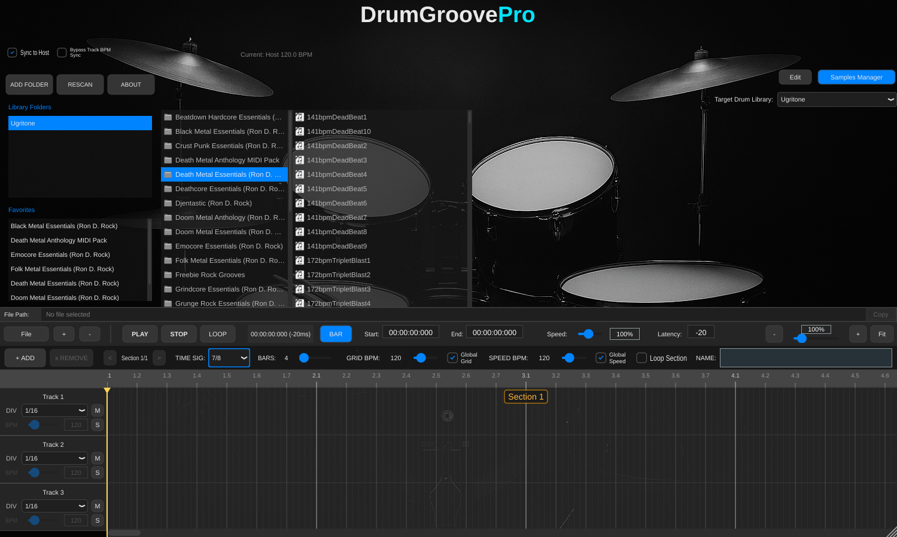
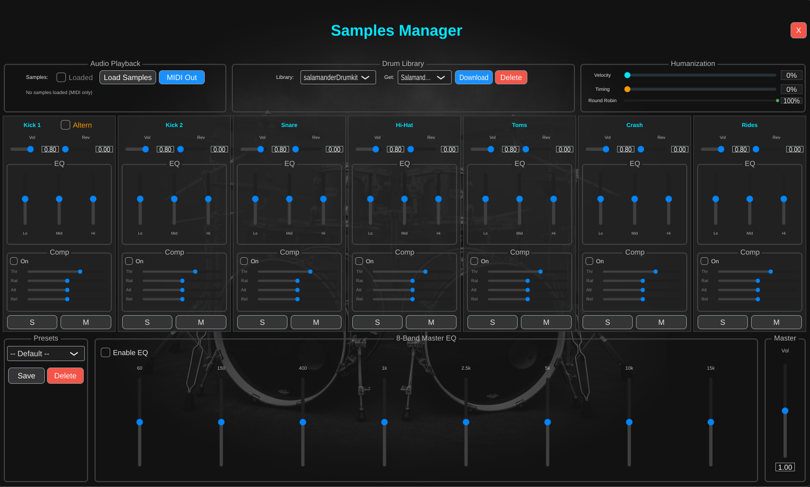

# DrumGroovePro

**A VST3 plugin for browsing, arranging, and exporting MIDI drum grooves with drum library remapping, multi-track timeline capabilities, and built-in audio sample playback with mixing.**




---

##  Overview

DrumGroovePro is a MIDI drum groove workstation designed for producers, composers, and drummers. It provides an intuitive interface for browsing your MIDI groove library, dissecting patterns into individual drum parts (kick, snare, hi-hat, etc.), and arranging them on a multi-track timeline with per-track BPM control.

**Perfect for:**
-  Quickly auditioning drum grooves at different tempos
-  Building complex drum arrangements from individual parts
-  Converting grooves between different drum libraries (Superior Drummer, Addictive Drums, EZdrummer, etc.)
-  Exporting complete drum arrangements as MIDI files
-  Creating custom drum patterns by mixing and matching parts
-  Playing drum samples directly with built-in mixer and effects
-  Using reference audio tracks to match your arrangements to existing songs

---

##  Key Features

###  **Smart MIDI Browsing**
- **Miller Columns Interface**: Navigate your groove library with an intuitive, multi-column browser
- **Real-time Preview**: Click to preview grooves instantly at your project's tempo
- **MIDI Dissection**: Automatically splits grooves into drum parts (Kick, Snare, Hi-Hat, Toms, Cymbals, Percussion)
- **Drag & Drop**: Drag MIDI files directly into your DAW or onto the timeline
- **Favorites System**: Save frequently used folders as favorites for quick access

###  **Multi-Track Timeline**
- **Unlimited MIDI Tracks**: Create as many tracks as you need for complex arrangements
- **Audio Reference Tracks**: Insert audio files (WAV, MP3, FLAC, OGG, AIFF) as reference tracks
- **Per-Track BPM Control**: Each track can have its own tempo (60-400 BPM)
- **Visual MIDI Preview**: See note patterns directly on clips
- **Snap-to-Grid**: Precise clip positioning with adjustable grid intervals
- **Loop Regions**: Set loop points for arrangement workflow
- **Solo/Mute**: Standard track controls for playback management
- **Playhead Speed Control**: Change the speed of playing to make further adjustments

###  **Samples Manager & 7-Channel Mixer**
Access the built-in audio engine via the Samples Manager window:

#### **Audio Playback Section**
- **Load Samples**: Download and load drum sample libraries (SFZ and DrumGizmo formats)
- **MIDI/Audio Mode Toggle**: Switch between:
  - **MIDI Out** (blue): Outputs MIDI notes to your DAW/drum plugin
  - **Audio Out** (orange): Plays samples directly through the built-in mixer

#### **Supported Sample Library Formats**
- **SFZ Format**: Standard SFZ format with ALL.sfz file
- **DrumGizmo Format**: XML-based format with KitName.xml and Midimap.xml

#### **Humanization Section**
Make your drum patterns sound more natural with three humanization controls:

| Control | Range | Effect at 100% |
|---------|-------|----------------|
| **Velocity** | 0-100% | ±15 velocity random variation |
| **Timing** | 0-100% | ±20ms timing random variation |
| **Round Robin** | 0-100% | Full cycling through available sample variations |

- **Velocity Humanization**: Adds random velocity variation to avoid robotic dynamics
- **Timing Humanization**: Adds subtle timing shifts for human feel
- **Round Robin**: Cycles through multiple sample recordings of the same drum hit to avoid the "machine gun" effect

#### **7-Channel Drum Mixer**
Each drum part has its own channel with full processing:

| Channel | MIDI Notes | Description |
|---------|------------|-------------|
| Kick 1 | 36 (C1) | Primary kick with Alternation toggle |
| Kick 2 | 35 (B0) | Secondary kick (independent processing) |
| Snare | 38-40 | Snare drum variations |
| Hi-Hat | 42, 44, 46 | Closed, pedal, open hi-hat |
| Toms | 41, 43, 45, 47, 48 | All tom drums |
| Crash | 54-64 | Crash cymbals |
| Rides | 49-53 | Ride cymbals |

#### **Per-Channel Controls**
- **Volume**: Channel output level (0.0 - 1.0)
- **Reverb Send**: Amount sent to global reverb (0.0 - 1.0)
- **3-Band EQ** (vertical sliders):
  - Low: 100 Hz shelf
  - Mid: 1 kHz peak
  - High: 8 kHz shelf
  - Range: ±12 dB per band
- **Compressor** (horizontal controls):
  - Enable toggle
  - Threshold: -60 to 0 dB
  - Ratio: 1:1 to 20:1
  - Attack: 0.1 to 100 ms
  - Release: 10 to 500 ms
  - Makeup Gain: 0 to 24 dB
- **Solo/Mute**: Standard channel controls

#### **Kick Alternation Feature**
The **Altern** toggle on Kick 1 prevents the "machine gun" effect on rapid kick patterns:
- When enabled, consecutive kicks (notes 35 or 36) alternate between Kick 1 and Kick 2
- Each alternated kick routes to its respective mixer channel
- Allows independent EQ/compression for natural-sounding double kicks

#### **Polyphonic Voice System**
- **64 Simultaneous Voices**: Professional-grade polyphony for complex patterns
- **Natural Decay Layering**: Multiple hits of the same drum overlap naturally (essential for metal/fast drumming)
- **Smooth Voice Stealing**: When all voices are busy, oldest voices fade out smoothly to prevent clicks
- **Crossfade Technology**: 5.8ms crossfade prevents audio artifacts during voice stealing

#### **Master Section**
- **8-Band Master EQ**: 60Hz, 150Hz, 400Hz, 1kHz, 2.5kHz, 5kHz, 10kHz, 15kHz (±12dB each)
- **Enable EQ Toggle**: Bypass master EQ processing
- **Master Volume**: Final output level (0.0 - 2.0)
- **Auto-Reverb**: Reverb automatically enables when any channel send > 0

#### **Mixer Presets**
- Save and load complete mixer configurations
- Includes all channel settings (volume, EQ, compressor, reverb send)
- Plus master EQ and reverb settings

### **Audio Reference Tracks**
Insert audio files as reference tracks for:
- Matching your drum arrangement to an existing song
- A/B comparison with professional mixes
- Creating drum covers by playing along with the original

**Supported formats**: WAV, MP3, FLAC, OGG, AIFF

**To insert an audio track:**
1. Click **File** button in the timeline controls
2. Select **"Insert Audio Track"**
3. Choose your audio file
4. The audio track appears with waveform visualization

### **BPM Management**
- **Automatic BPM Synchronization**: 
  - New tracks automatically inherit current Header BPM
  - Empty tracks update when Header BPM changes
  - Tracks with clips preserve their original BPM
- **Bypass Track BPM Sync**: Optional checkbox to disable automatic synchronization
  - When enabled, new tracks default to 120 BPM regardless of Header BPM
  - Gives manual control over track tempos
  - Works in both TIME and BAR modes
- **Dual BPM Sources**:
  - **Sync to Host**: Follow your DAW's tempo automatically
  - **Manual BPM**: Set custom tempo (60-400 BPM) independent of host
- **GRID BPM Synchronization**: In BAR mode, grid display always reflects current Header BPM

### **BAR Mode & Section Management**
- **TIME/BAR Toggle**: Switch between time-based and bar-based timeline views
- **Musical Sections**: Divide your arrangement into sections with independent settings
- **Time Signatures**: Set different time signatures per section (4/4, 3/4, 5/4, 6/8, 7/8, and more)
- **Dual BPM Control**:
  - **Grid BPM**: Controls visual bar width and snap-to-grid spacing
  - **Speed BPM**: Controls actual playback tempo (play sections faster/slower)
- **Section Loop**: Loop individual sections for focused editing
- **Bar Numbers**: Visual ruler shows bar numbers instead of time in BAR mode
- **Section-Aware Snapping**: Clips snap to beats based on section time signature and DIV setting
- **Visual Scaling**: Bars automatically scale based on Grid BPM while maintaining playback accuracy

###  **Visual Latency Compensation**

- Adjustable from -200ms to 0ms
- Compensates for system/hardware audio latency
- Negative values make visual playhead lag behind audio (normal)
- Default: -20ms
- Controlled via Latency field in timeline controls

###  **Drum Remapping**
- **17 Supported Libraries "Out of the box"**:
- Addictive Drums 2
- BFD3
- Damage 2
- Drum Locker
- EZdrummer
- General MIDI
- GetGood Drums
- ML Drums
- MODO Drum
- MT Power Drum Kit 2
- MuldjordKit
- Salamander Drumkit
- Shreddage Drums
- Sitala
- Steven Slate Drums
- Superior Drummer 3
- Ugritone
  
**Seamless Conversion**: Drag a Superior Drummer groove onto a track set to EZdrummer—notes are automatically remapped.

#### Origin Library System
The Origin Library Manager configures which drum libraries you have MIDI files from:

- **Default XML Creation**: On first run, creates `OriginLibraries.xml` with all supported libraries
- **Custom Libraries**: Add custom MIDI sources with user-defined names
- **Note Mapping Editor**: Define how notes map from origin library to General MIDI
- **Protected Libraries**: General MIDI and Unknown cannot be deleted
- **Automatic Persistence**: Changes save immediately to XML

**Workflow:**
1. Click "Edit" next to Add Folder button
2. Select origin library from list or add custom library
3. Define note mappings (Origin Note → GM Note) with drum names
4. Custom drum names default to GM standard names, editable per note
5. Mappings saved to `CustomDrumMappings.xml`

**XML are stored in:**
- Windows: `%APPDATA%\DrumGroovePro\`
- macOS: `~/Library/Application Support/DrumGroovePro/`
- Linux: `~/.config/DrumGroovePro`

#### Target Library System
The Target Library dropdown controls output remapping:

- **Runtime Selection**: Choose target drum library from dropdown in browser
- **Custom Mappings**: Edit target library mappings via "Edit" button
- **Two-Way Mapping**: Origin library maps to GM, GM maps to target library
- **Real-time Conversion**: Notes automatically remapped during playback and export

**Example:**
- MIDI file from Superior Drummer 3 (kick on C1)
- Origin mapping: SD3 C1 → GM C0
- Target set to EZdrummer
- Target mapping: GM C0 → EZdrummer C0
- Result: Notes correctly mapped to EZdrummer specification

#### Export and Drag Behavior
The plugin handles remapping differently depending on the operation:

**Inside Plugin (Playback):**
- Real-time remapping during preview and timeline playback
- Original MIDI files remain untouched
- Changing target library instantly updates all clips

**Export Operations:**
When dragging to DAW or exporting to desktop, notes are permanently remapped in the exported file:
- Drag from browser to DAW creates temporary file with remapped notes
- Right-click export to desktop creates file with remapped notes
- Timeline export creates file with remapped notes
- Original files in your library are never modified

**Bypass Mode:**
Set target library to "Bypass" to preserve original note mappings in all operations.

###  **Project Management**
- **Save/Load Timeline State**: Save complete timeline arrangements with all tracks, clips, and BPM settings
- **Persistent Temporary Files**: Dissected drum parts are automatically saved with your project
- **Audio Track Support**: Audio reference tracks are saved and restored with your project

---

##  System Requirements

### Windows
- **OS**: Windows 10 or Windows 11 (64-bit)
- **CPU**: Intel Core i5 / AMD Ryzen 5 or better
- **RAM**: 4 GB minimum, 8 GB recommended
- **Storage**: 50 MB for plugin installation
- **DAW**: Any VST3-compatible host (Reaper, FL Studio, Ableton Live, Cubase, Studio One, etc.)

### Linux
- **OS**: Tested on Arch Linux and Fedora (64-bit)
- **CPU**: Intel Core i5 / AMD Ryzen 5 or better
- **RAM**: 4 GB minimum, 8 GB recommended
- **Storage**: 50 MB for plugin installation
- **DAW**: Any VST3-compatible host (Reaper, Ardour, Carla, etc.)

### macOS

- **OS**: macOS 10.15 (Catalina) or later
- **CPU**: Intel Core i5 or Apple Silicon (M1/M2/M3/M4) or better
- **RAM**: 4 GB minimum, 8 GB recommended
- **Storage**: 50 MB for plugin installation
- **DAW**: Any VST3-compatible host (Logic Pro, GarageBand, Reaper, Ableton Live, Cubase, Studio One, etc.)

---

##  Installation

### Quick Install (Windows)

1. **Download** the latest release from the [Releases page](https://github.com/InToEtherion/DrumGroovePro/releases)

2. **Extract** the ZIP file:
   ```
   DrumGroovePro_vX.X.X_Windows_x64.zip
   ```

3. **Copy** `DrumGroovePro.vst3` to your VST3 folder:
   ```
   C:\Program Files\Common Files\VST3\
   ```

4. **Restart** your DAW and scan for new plugins

5. **Load** DrumGroovePro as a MIDI effect on any track


### Quick Install (Linux)

1. **Download** the latest release from the [Releases page](https://github.com/InToEtherion/DrumGroovePro/releases)

2. **Extract** the ZIP file:
   ```
   DrumGroovePro_vX.X.X_Linux_x64.zip
   ```

3. **Copy** `DrumGroovePro.vst3` to your VST3 folder:
   ```
   ~/.vst3/
   ```

4. **Restart** your DAW and scan for new plugins

5. **Load** DrumGroovePro as a MIDI effect on any track

### Quick Install (macOS)

1. **Download** the latest release from the [Releases page](https://github.com/InToEtherion/DrumGroovePro/releases)

2. **Extract** the ZIP file:
   ```
   DrumGroovePro_vX.X.X_MACOS_x64.zip
   ```
3. **Copy** `DrumGroovePro.vst3` to your VST3 folder:
   ```
   ~/Library/Audio/Plug-Ins/VST3/
   ```

4. **Restart** your DAW and scan for new plugins

5. **Load** DrumGroovePro as a MIDI effect on any track

---

##  Quick Start Guide

### **Browse Your Library**

1. Navigate through folders using the **Miller Columns browser** (center)
2. **Click** on a MIDI file to preview it
3. **Double-click** to dissect it into drum parts (Kick, Snare, Hi-Hat, etc.)
4. **Click** on individual drum parts to preview them

---

### **Build Your Arrangement**

#### Option A: Drag to Timeline
1. **Drag** a MIDI file or drum part from the browser
2. **Drop** onto a track in the timeline (bottom)
3. The clip appears with visual MIDI preview

#### Option B: Drag to DAW
1. **Drag** a MIDI file from the browser (with "Control" pressed) or from Timeline with "Control + Alt" pressed
2. **Drop** directly onto a Reaper track 
3. MIDI file is imported at the current plugin BPM setting

---

### **Add Reference Audio**

1. Click the **"File"** button in the timeline controls
2. Select **"Insert Audio Track"**
3. Choose your audio file (WAV, MP3, FLAC, OGG, or AIFF)
4. The audio track appears below your MIDI tracks with waveform display
5. Use **Solo/Mute** buttons to compare your arrangement with the reference

---

### **Adjust Tempo**

#### Sync to Host:
- **Enable** "Sync to Host" in the header
- All playback follows your DAW's tempo
- New tracks automatically match host tempo

#### Manual BPM:
- **Disable** "Sync to Host"
- Use the **BPM slider** to set a custom tempo (60-400 BPM)
- New tracks automatically inherit this manual BPM

#### Per-Track BPM:
- Each track has its own **BPM control** in the track header
- Empty tracks update automatically when Header BPM changes
- Tracks with clips preserve their original BPM
- Perfect for polyrhythmic arrangements or tempo experiments

#### Bypass Track BPM Sync:
- **Enable** "Bypass Track BPM Sync" checkbox (next to Current BPM display)
- New tracks default to 120 BPM regardless of Header BPM setting
- Header BPM changes will not affect any tracks
- Useful when you want complete manual control over all track tempos

---

### **Use the Samples Manager**

1. Click the **"Samples"** button in the header to open the Samples Manager
2. Select a drum library from the **Library** dropdown
3. Click **"Load Samples"** to load the sample library
4. Click **"Audio Out"** to switch from MIDI to audio playback mode
5. Adjust the **7-channel mixer** to shape your drum sound:
   - Set volume and reverb send per channel
   - Use 3-band EQ for tonal shaping
   - Apply compression for punch and consistency
6. Enable **Kick Alternation** on Kick 1 for natural double-kick sounds
7. Use the **8-Band Master EQ** for final polish
8. **Save your mixer settings** as a preset for later use

---

### **Use Humanization**

1. In the Samples Manager, find the **Humanization** section (top-right)
2. Adjust the three sliders:
   - **Velocity**: Add random velocity variation (0-100%)
   - **Timing**: Add random timing variation (0-100%)
   - **Round Robin**: Control sample variation cycling (0-100%)
3. Start with subtle settings (20-30%) and increase to taste
4. **Tip**: For metal double-kick patterns, use 0% Timing but 100% Round Robin

---

### **Set Target Drum Library**

1. Use the **"Target Drum Library"** dropdown (top-right of browser)
2. Select your drum plugin (e.g., "EZdrummer")
3. All grooves and parts will automatically remap notes to match your drum library

**Example:**
- Drag a Superior Drummer 3 groove (kick on C1)
- Set target to EZdrummer (kick on C0)
- Notes are automatically remapped to C0!

---

### **Export Your Work**

#### Save Timeline State:
1. Click **"File"** button → **"Save Timeline State"**
2. Choose a folder to save your project
3. All tracks, clips, BPM settings, audio tracks, and temporary files are saved

#### Export MIDI as 1 file:
1. Click **"File"** button → **"Export as MIDI"**
2. Choose a folder to save your MIDI
3. All tracks, BPM settings are merged into 1 MIDI and is saved

#### Export MIDI, one MIDI per track:
1. Click **"File"** button → **"Export Tracks as Separate MIDIs"**
2. Choose a folder to save your MIDI
3. All tracks, BPM settings are saved per Track (You choose to maintain initial silence [if any])

---

## File Menu Reference

| Menu Item | Description |
|-----------|-------------|
| **Save Timeline State** | Save complete project with all tracks and settings |
| **Load Timeline State** | Load a previously saved project |
| **Export as MIDI** | Export all tracks merged into single MIDI file |
| **Export Tracks as Separate MIDIs** | Export each track as individual MIDI file |
| **Insert Audio Track** | Add an audio reference track |

---

## Keyboard Shortcuts

| Shortcut | Action |
|----------|--------|
| **Space** | Play/Stop |
| **Ctrl + A** | Select all clips |
| **Ctrl + C** | Copy selected clips |
| **Ctrl + V** | Paste clips |
| **Delete** | Delete selected clips |
| **Ctrl + Drag** | Drag MIDI from browser to DAW |
| **Ctrl + Alt + Drag** | Drag MIDI from timeline to DAW |

---

## Building from Source

### Platform-Specific Requirements
### Windows

Visual Studio 2019 or later
Windows SDK

### macOS

Xcode 12 or later
macOS 10.13 or higher
For Universal Binary (Intel + Apple Silicon):

Xcode 12.2+ on macOS 11+ recommended

### Linux

GCC 9+ or Clang 10+
Development libraries:

```bash
# Ubuntu/Debian
sudo apt-get install build-essential cmake libasound2-dev libjack-jackd2-dev \
    libfreetype6-dev libx11-dev libxcomposite-dev libxcursor-dev libxext-dev \
    libxinerama-dev libxrandr-dev libxrender-dev libwebkit2gtk-4.0-dev \
    libglu1-mesa-dev mesa-common-dev

# Fedora
sudo dnf install cmake gcc-c++ alsa-lib-devel jack-audio-connection-kit-devel \
    freetype-devel libX11-devel libXcomposite-devel libXcursor-devel \
    libXext-devel libXinerama-devel libXrandr-devel libXrender-devel \
    mesa-libGLU-devel

# Arch Linux
sudo pacman -S base-devel cmake alsa-lib jack freetype2 libx11 \
    libxcomposite libxcursor libxext libxinerama libxrandr \
    libxrender webkit2gtk glu
```

### Prerequisites 

- **CMake** 3.22 or higher
- **Visual Studio 2022** (Windows)
- **JUCE** 8+ (included as submodule)
- **Git**


### Build Steps

```bash
# Clone JUCE (8.0.10)
git clone --recursive https://github.com/juce-framework/JUCE.git

# Clone repository
git clone https://github.com/InToEtherion/DrumGroovePro.git
cd DrumGroovePro

# Create build directory
mkdir build
cd build

# Configure with CMake
cmake ..

# Build (Release mode)
cmake --build . --config Release --parallel
```

**macOS Universal Binary Build (Intel + Apple Silicon)**

```bash
# Configure with Universal Binary flag
cmake -DCMAKE_OSX_ARCHITECTURES="arm64;x86_64" ..

# Build
cmake --build . --config Release --parallel
```

### Project Structure

```
DrumGroovePro/
├── Source/
│   ├── Core/               # MIDI processing and drum library logic
│   │   ├── MidiProcessor.cpp
│   │   ├── MidiDissector.cpp
│   │   ├── DrumLibraryManager.cpp
│   │   ├── FavoritesManager.cpp
│   │   └── SectionManager.cpp
│   ├── GUI/
│   │   ├── Components/     # UI components
│   │   │   ├── GrooveBrowser.cpp
│   │   │   ├── MultiTrackContainer.cpp
│   │   │   ├── Track.cpp
│   │   │   ├── AudioTrack.cpp
│   │   │   ├── TimelineManager.cpp
│   │   │   ├── SectionBar.cpp
│   │   │   └── ...
│   │   ├── LookAndFeel/    # Visual styling
│   │   ├── SamplesManagerWindow.cpp  # Mixer UI
│   │   └── EQPresetManager.cpp       # Mixer presets
│   ├── Utils/              # Audio/MIDI utilities
│   │   ├── DrumMixer.cpp         # 7-channel mixer
│   │   ├── DrumMixerChannel.cpp  # Per-channel processing
│   │   ├── SimpleEQ.cpp          # 3-band EQ
│   │   ├── DrumCompressor.cpp    # Per-channel compressor
│   │   ├── ReverbProcessor.cpp   # Global reverb
│   │   ├── SampleEngine.cpp      # Sample playback engine
│   │   ├── SampleVoice.cpp       # Polyphonic voice management
│   │   ├── SFZParser.cpp         # SFZ file parser
│   │   └── DrumGizmoParser.cpp   # DrumGizmo XML parser
│   ├── PluginProcessor.cpp # Main plugin logic
│   └── PluginEditor.cpp    # Plugin UI root
├── Resources/              # Icons, backgrounds, and assets
│   ├── icons/
│   ├── logo/
│   └── background/
├── CMakeLists.txt          # Build configuration
└── README.md
```

---

## Contributing

Contributions are welcome! If you'd like to contribute:

1. Fork the repository
2. Create a feature branch (`git checkout -b feature/amazing-feature`)
3. Commit your changes (`git commit -m 'Add amazing feature'`)
4. Push to the branch (`git push origin feature/amazing-feature`)
5. Open a Pull Request

### Reporting Issues

Found a bug? Please open an issue with:
- Detailed description of the problem
- Steps to reproduce
- Your system info (OS, DAW, plugin version)
- Screenshots if applicable

---

## Support

- **Issues**: [GitHub Issues](https://github.com/InToEtherion/DrumGroovePro/issues)
- **Discussions**: [GitHub Discussions](https://github.com/InToEtherion/DrumGroovePro/discussions)
- **Updates**: Check for updates in the plugin's About dialog

---

##  Acknowledgments

- **JUCE Framework**: For the powerful audio plugin framework
- **Salamander Drumkit**: Open source drum samples
- **DrumGizmo**: Open source drum sampler format support

---

##  Support Development

If you find DrumGroovePro useful, consider supporting its development:

**[Buy Me a Coffee ☕](https://coff.ee/intoetherion)**

Your support helps maintain and improve the plugin!

---

## License

DrumGroovePro is licensed under the **GNU General Public License v3.0**.

This means you can:
- ✅ Use it for free (personal and commercial)
- ✅ Modify the source code
- ✅ Distribute modified versions

**But you must:**
- Share modifications under the same GPL v3 license
- Include the original license and copyright notice
- Make source code available if you distribute the plugin

See [LICENSE](LICENSE) for full details.
